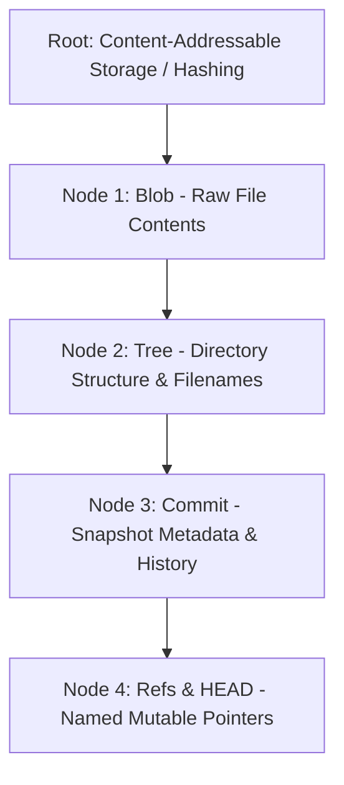
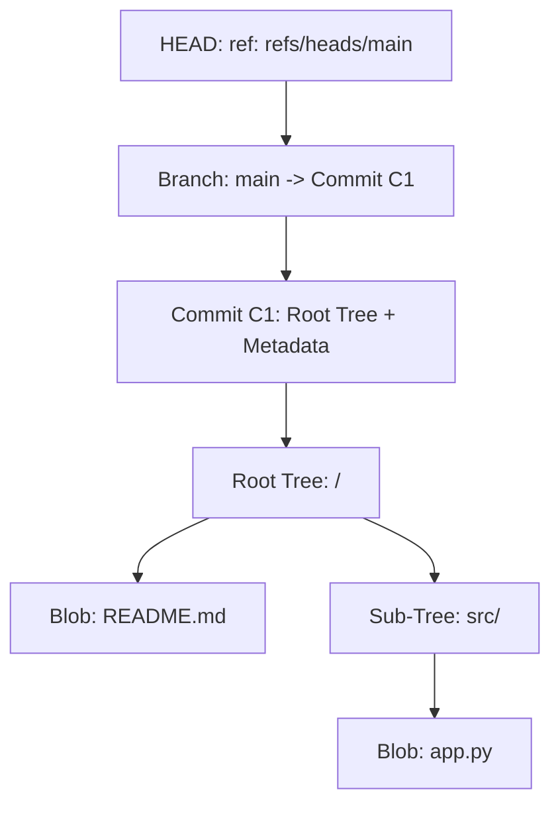

# Lesson: How Git Works Under the Hood

**Topic:** Git Internals (Blobs, Trees, Commits, Refs)
**Date:** 2026-10-01
**Goal:** Build a robust, intuitive mental model of Git's internal object store and graph structure.

---

## 1. Lesson Dependency Roadmap



---

## 2. Session Transcript & Key Insights

> [!abstract] Step 1: Content Addressability & Blobs
> **The Motivating Problem:** How do you store versioned files across time with zero redundant copies and instant integrity verification?
> 
> **The Foundational Invariant:**
> - Everything in Git's object store is addressed by the cryptographic hash of its content: $\text{Hash} = \text{SHA}(\text{content})$.
> - **Blob (Binary Large Object):** Contains **only raw file bytes**.
> - A blob has **no** filename, **no** directory path, and **no** permissions.
> - If two files across different folders share identical content, Git stores exactly **one** blob.

---

> [!question] Checkpoint 1: Identical content across different paths
> **Question:** If `src/main.py` and `backup/old_main.py` have identical content, what is stored?
> - **Initial Selection:** Two separate blobs due to path differences.
> - **Correction & Core Takeaway:** Blobs calculate $\text{Hash} = \text{SHA}(\text{bytes})$. Because the contents are identical, the hashes match exactly. Git stores **only one blob**. The filename and directory paths live entirely outside the blob in a **Tree object**.

---

> [!abstract] Step 2: Trees (Directories & Filenames)
> Since blobs have no names, Git represents directories as **Tree objects**.
> A tree contains a list of entries mapping:
> `[File Mode] [Type: blob/tree] [SHA Hash] [Name]`
> 
> ```text
> 100644 blob b45fd6... main.py
> 040000 tree 8a3f12... src/
> ```
> This structure allows Git to recreate the entire directory hierarchy cleanly.

---

> [!abstract] Step 3: Commits (Snapshots & History)
> A **Commit object** packages the top-level tree with historical context:
> 1. **Tree Pointer:** Points to the root directory Tree hash (a snapshot of the entire project).
> 2. **Parent Pointer(s):** The SHA-1 hash of previous commit(s), forming a directed acyclic graph (DAG).
> 3. **Metadata:** Author, committer, timestamp, and commit message.

---

> [!abstract] Step 4: Refs & HEAD (Mutable Labels)
> - Branches and tags are **not** heavy branches of code; they are simply **Refs** (text files holding a 40-character commit hash).
> - `HEAD` is a reference file pointing to your active branch (e.g., `ref: refs/heads/main`).

---

> [!question] Checkpoint 2: What happens on a new commit?
> **Question:** When editing 1 line in `src/app.py` and committing, what is created?
> - **Initial Selection:** Existing commit is overwritten in-place with a diff.
> - **Correction & The Immutability Rule:** Objects in Git are **strictly append-only and immutable**. Because an object's filename is its cryptographic hash, nothing in `.git/objects/` is ever modified in-place.
> 
> **What actually happens:**
> 1. **New Blob:** Git writes **one new blob** for `src/app.py`.
> 2. **Reused Blobs:** All unchanged files keep their existing blobs.
> 3. **New Trees:** A new sub-tree for `src/` and a new root tree `/` are created to point to the new blob (and reuse the old blobs).
> 4. **New Commit:** A new commit object is written, pointing to the new root tree and referencing the old commit as its parent.
> 5. **Branch Update:** The branch pointer (`main`) is moved to point to the new commit SHA.

---

## 3. Summary & Mental Model Takeaway



**The Click:**
Git is not a diff-tracker; it is a **content-addressable filesystem** with a DAG of immutable snapshots overlaid with mutable text-file pointers (branches).

