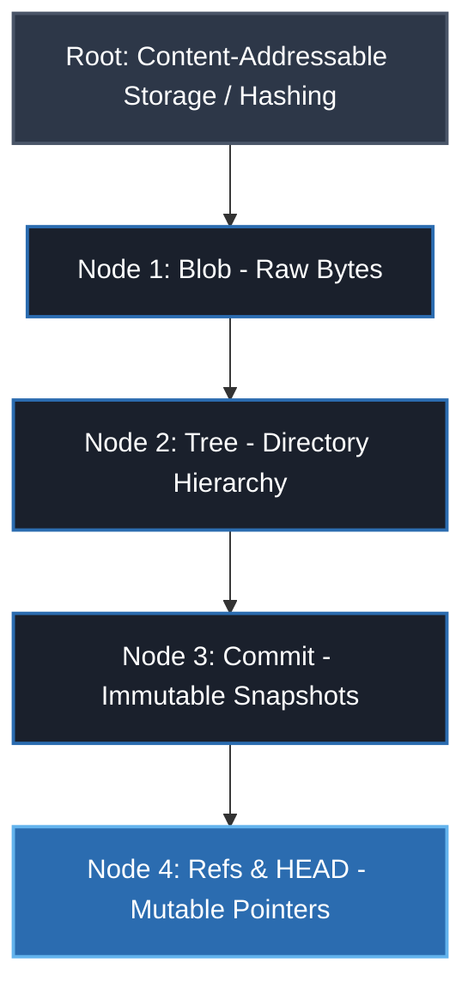
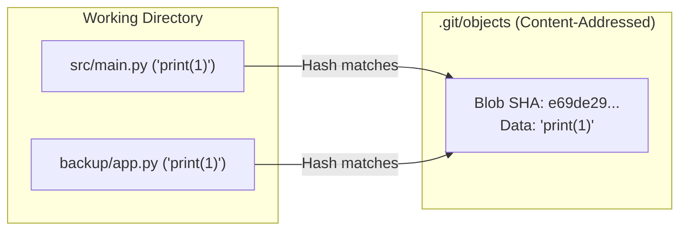
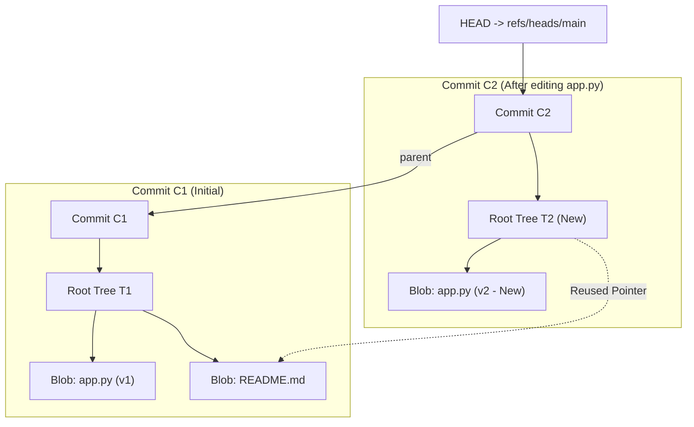
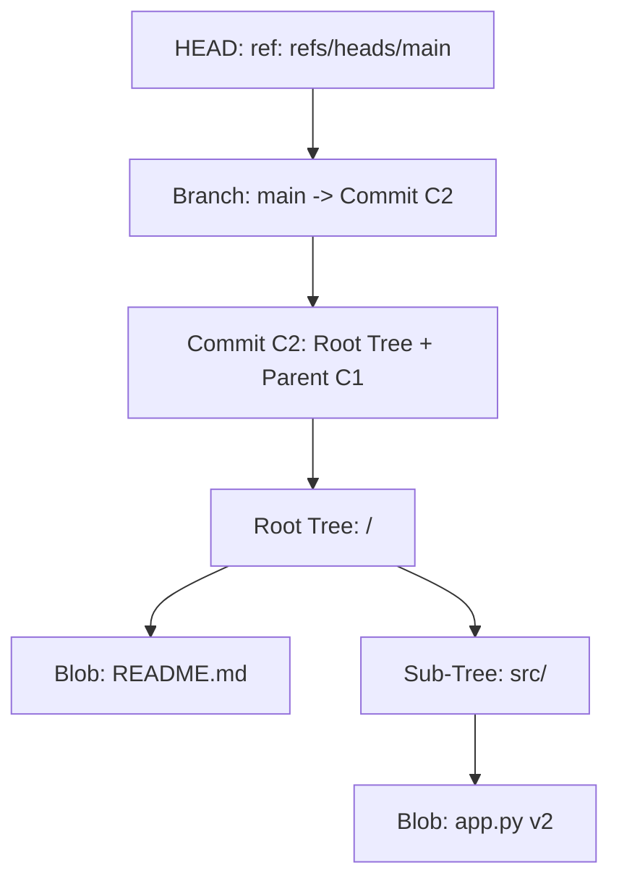

# Lesson: How Git Works Under the Hood

**Topic:** Git Internals (Blobs, Trees, Commits, Refs)
**Date:** 2026-10-01
**Related Notes:** [[01-Projects/Learn/README|AI Learning System]] | [[01-Projects/Learn/Architecture-and-Components|Architecture & Components]] | [[01-Projects/README|Projects Index]]
**Goal:** Build a robust, intuitive mental model of Git's internal object store and graph structure.

---

## 1. Lesson Dependency Roadmap



---

## 2. Session Transcript & Visual Insights

> [!abstract] Step 1: Content Addressability & Blobs
> **The Motivating Problem:** How do you store versioned files across time with zero redundant copies and instant integrity verification?
> 
> **The Foundational Invariant:**
> - Everything in Git's object store is addressed by the cryptographic hash of its content: $\text{Hash} = \text{SHA}(\text{content})$.
> - **Blob (Binary Large Object):** Contains **only raw file bytes**.
> - A blob has **no** filename, **no** directory path, and **no** permissions.
> - If two files across different folders share identical content, Git stores exactly **one** blob.



---

> [!question] Checkpoint 1: Identical content across different paths
> **Question:** If `src/main.py` and `backup/old_main.py` have identical content, what is stored?
> - **Initial Selection:** Two separate blobs due to path differences.
> - **Correction & Core Takeaway:** Blobs calculate $\text{Hash} = \text{SHA}(\text{bytes})$. Because the contents are identical, the hashes match exactly. Git stores **only one blob**. The filename and directory paths live entirely outside the blob in a **Tree object**.

---

> [!abstract] Step 2: Trees (Directories & Filenames)
> Since blobs have no names, Git represents directories as **Tree objects**.
> A tree contains a list of entries mapping:
> `[File Mode] [Type: blob/tree] [SHA Hash] [Name]`
> 
> ```text
> 100644 blob b45fd6... main.py
> 040000 tree 8a3f12... src/
> ```
> This structure allows Git to recreate the entire directory hierarchy cleanly.

---

> [!abstract] Step 3: Commits (Snapshots & History)
> A **Commit object** packages the top-level tree with historical context:
> 1. **Tree Pointer:** Points to the root directory Tree hash (a snapshot of the entire project).
> 2. **Parent Pointer(s):** The SHA-1 hash of previous commit(s), forming a directed acyclic graph (DAG).
> 3. **Metadata:** Author, committer, timestamp, and commit message.

---

> [!abstract] Step 4: Refs & HEAD (Mutable Labels)
> - Branches and tags are **not** heavy branches of code; they are simply **Refs** (text files holding a 40-character commit hash).
> - `HEAD` is a reference file pointing to your active branch (e.g., `ref: refs/heads/main`).

---

> [!question] Checkpoint 2: What happens on a new commit?
> **Question:** When editing 1 line in `src/app.py` and committing, what is created?
> - **Initial Selection:** Existing commit is overwritten in-place with a diff.
> - **Correction & The Immutability Rule:** Objects in Git are **strictly append-only and immutable**. Because an object's filename is its cryptographic hash, nothing in `.git/objects/` is ever modified in-place.



---

## 3. Summary & Mental Model Takeaway



**The Click:**
Git is not a diff-tracker; it is a **content-addressable filesystem** with a DAG of immutable snapshots overlaid with mutable text-file pointers (branches).

---

## 4. Spaced Repetition Flashcards

What does a Git Blob object store? #card
Only the raw byte contents of a file. It does NOT store filenames, directory paths, or file permissions.
<!--ID: 1727800000001-->

Where are filenames and directory paths stored in Git's object model? #card
In Tree objects. A Tree maps filenames and permissions to Blob and sub-Tree hashes.
<!--ID: 1727800000002-->

Why does Git never modify an existing object in `.git/objects/` when you edit a file? #card
Because Git is content-addressable: an object's ID is the cryptographic hash of its exact contents. Changing any byte creates a brand new hash (a new object file).
<!--ID: 1727800000003-->

What happens to unchanged files when you make a new commit? #card
They are NOT re-copied. The new Tree object simply points to the pre-existing Blob hashes.
<!--ID: 1727800000004-->

What actually is a Git branch under the hood? #card
A plain 41-byte text file in `.git/refs/heads/<name>` containing the SHA-1/SHA-256 hash of its tip commit.
<!--ID: 1727800000005-->
