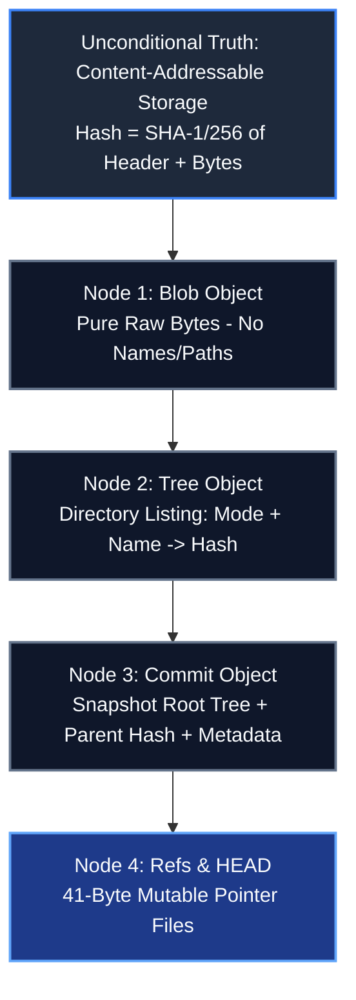
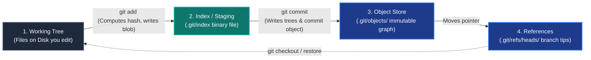
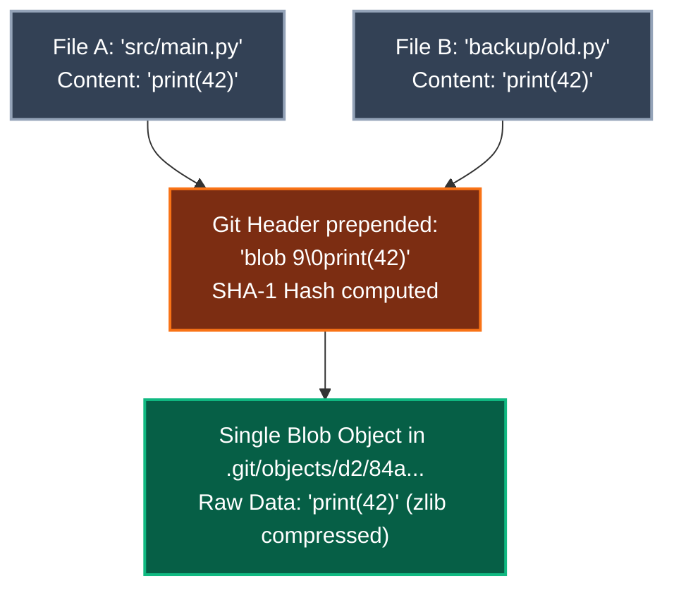
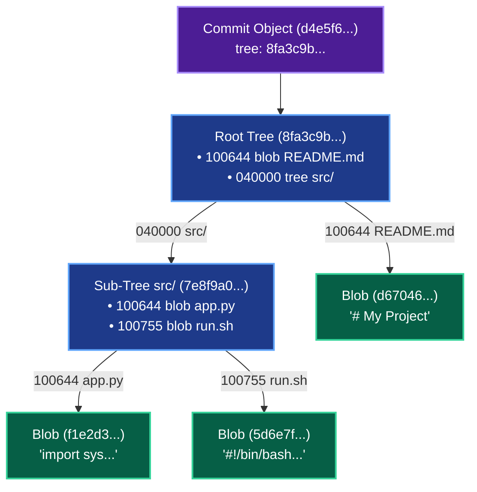
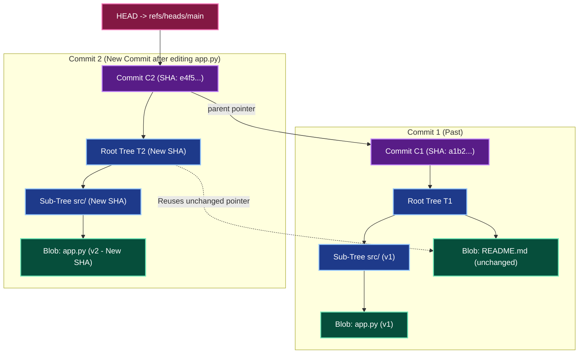

# Lesson: How Git Works Under the Hood

**Topic:** Git Internals (Blobs, Trees, Commits, Refs)
**Date:** 2026-10-01
**Related Notes:** [[01-Projects/Learn/README|AI Learning System]] | [[01-Projects/Learn/Architecture-and-Components|Architecture & Components]] | [[01-Projects/README|Projects Index]]
**Goal:** Build a robust, intuitive mental model of Git's internal object store, immutability guarantees, and pointer architecture.

---

## 1. Lesson Dependency Roadmap

---

## 2. Visual Architecture & Core Mechanisms

### Diagram 1: The Three Areas of Git Lifecycle
Every routine Git command simply synchronizes state across three separate regions:

---

### Diagram 2: Inside a Blob & Content Deduplication
A **Blob** stores *only raw bytes*. The filename and path live outside the blob in directory trees.

> [!abstract] Unconditional Invariant 1: Blobs
> $\text{Blob Hash} = \text{SHA}\left(\text{"blob "} + \text{byte\_length} + \text{"\0"} + \text{content}\right)$
> - Because identical files share the exact same byte hash, Git **deduplicates automatically at zero extra storage cost**.
> - The blob does **not** know what it is named or what folder it lives in.

---

### Diagram 3: How Trees Recreate Directory Hierarchies
A **Tree Object** maps filenames and permission modes to Blob hashes and child Tree hashes:

---

### Diagram 4: What Actually Happens During a New Commit (Immutability)
Git **never overwrites** old objects. Modifying 1 line in `app.py` creates a brand-new blob and new parent trees, while unchanged blobs are cleanly reused:

---

## 3. Session Diagnostics & Checkpoint Insights

> [!question] Checkpoint 1: Identical content across different folders
> **Question:** If `src/main.py` and `backup/old_main.py` have identical code, what is stored in `.git/objects/`?
> - **Misconception:** Two separate blobs are stored because the paths and filenames differ.
> - **Mental Model Repair:** Blobs store raw byte payloads only. Filenames exist strictly inside Tree objects. Git stores **only one blob**.

> [!question] Checkpoint 2: What happens on a new commit?
> **Question:** When editing 1 line in `src/app.py` and committing, what is created?
> - **Misconception:** The existing commit object is modified in-place with a diff.
> - **Mental Model Repair:** Git is strictly **append-only and immutable**. Because an object's ID is the hash of its content, altering any byte changes its hash. Git writes **1 new blob**, **new parent trees**, and **1 new commit object** pointing back to the previous commit.

---

## 4. Spaced Repetition Flashcards

### Basic Concept Cards
What does a Git Blob object store? #card
Only the raw byte contents of a file. It does NOT store filenames, directory paths, or file permissions.
<!--ID: 1727800000001-->

Where are filenames and directory permissions stored in Git's object model? #card
Inside Tree objects. A Tree maps (mode, name) pairs to Blob and sub-Tree hashes.
<!--ID: 1727800000002-->

What are the four fundamental object types in Git? #card
1. **Blob**: Raw file contents
2. **Tree**: Directory listing (names, modes, object hashes)
3. **Commit**: Snapshot pointer to root tree + parent commit(s) + author/message metadata
4. **Tag**: Annotated named reference pointing to an object
<!--ID: 1727800000003-->

Why does Git never modify an existing object in `.git/objects/` in-place? #card
Because Git is a content-addressable filesystem. An object's filename is the cryptographic hash of its exact bytes. Any modification produces a brand-new hash (a new object file).
<!--ID: 1727800000004-->

What actually is a Git branch under the hood? #card
A plain 41-byte text file located at `.git/refs/heads/<branch-name>` containing the SHA hash of the latest commit on that branch.
<!--ID: 1727800000005-->

What does a Git Commit object point to to represent the repository state? #card
It points directly to a single **Root Tree object**, which represents the complete snapshot of the project at that moment in time.
<!--ID: 1727800000006-->

### Cloze Deletion Cards
Git is not a diff tracker; it is a ==content-addressable== filesystem that stores a directed acyclic graph of immutable ==snapshots==. #card
<!--ID: 1727800000007-->

When 100 identical files exist across different directories in a Git repository, Git creates exactly ==one== blob object in `.git/objects/`. #card
<!--ID: 1727800000008-->

A Git commit's parent pointer creates a ==directed acyclic graph (DAG)== where history can only grow forward because a commit's hash depends on its ==parent's hash==. #card
<!--ID: 1727800000009-->
