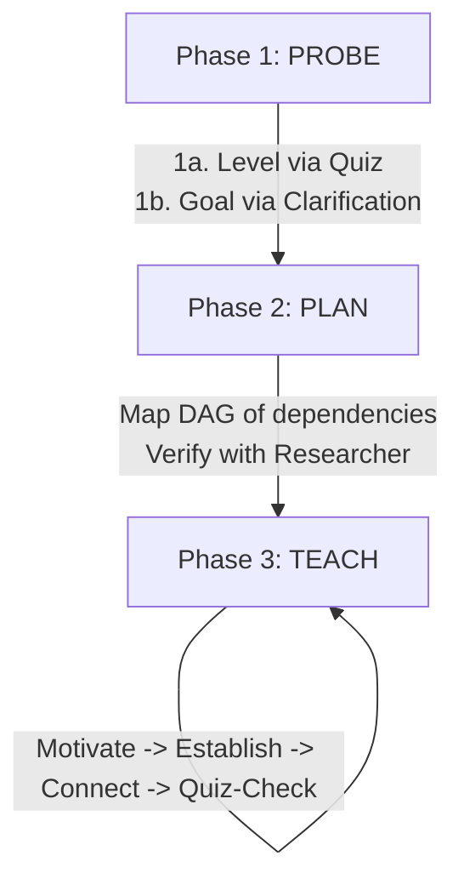

# Architecture & Components: AI Learning System

**Repository:** `amosblomqvist/learn`
**Philosophy:** Understanding over memorization; building connected mental dependency graphs.

---

## 1. Core Teaching Philosophy (`skills/teach`)

The system is structured around two non-negotiable principles:

### Principle I: Unconditional Truths First (Foundations)
- **Grounding in Invariants:** Establish facts that can be accepted at face value without nuance, caveats, or conditional exceptions.
- **Universal Statements & Real Definitions:** Use crisp, exception-free formulations (e.g., *"All X is done via Y"*).
- **Safety to Commit:** The human brain resists locking in facts if a deeper contradiction might invalidate them later. Securing unconditional truths removes this hedging.

### Principle II: Motivated Discovery ("How could I have discovered this?")
- **Eliminate Arbitrariness:** Avoid presenting formulas or algorithms as arbitrary decrees.
- **3Blue1Brown Pedagogy:** Reconstruct the original problem pressure that forced someone to invent the solution.
- **Socratic vs. Expository:** Socratic loops when the learner can plausibly reason forward; expository narration when cognitive load is high.

---

## 2. The Three-Phase Execution Loop

1. **Phase 1: Probe (Mapping the Frontier)**
   - **Bracket the Edge:** Binary-search the learner's knowledge boundaries using targeted quizzes (find both a solid floor and where understanding breaks).
   - **Identify Misconceptions:** Diagnose *why* a distractor was picked, not just whether the answer was right or wrong.
   - **Clarify the Goal:** Pin down what the user actually wants to achieve.

2. **Phase 2: Plan (Graph Architecture)**
   - Research core truths and verify facts using web verification subagents.
   - Construct a directed acyclic graph (DAG) of concepts starting with foundational roots leading to the learning goal.
   - Present the roadmap and gain confirmation before starting instruction.

3. **Phase 3: Teach (Node-by-Node Construction)**
   - **Motivate:** Why do we need this node now?
   - **Establish:** Ground the truth or derive it step-by-step.
   - **Connect:** Explicitly attach the new concept to existing graph nodes.
   - **Quiz-Check:** Verify retention and understanding before building higher.

---

## 3. Subagent & Extension Architecture

### Visual Diagram Makers
- **`mermaid-maker`:** Relational diagrams (flows, trees, state machines, timelines, dependency DAGs).
- **`svg-maker`:** Spatial and geometric precision diagrams (vectors, coordinate plots, physical layouts).
- **Visual Verification Loop:** Subagents render the diagram to PNG, inspect the image to verify correctness and layout legibility, and save it directly into the vault (`viz/` folder) for inline embedding: `![[viz-topic-timestamp.png|500]]`.

### Interactive UI Extensions
- **`quiz`:** Interactive, graded multiple-choice / multi-select tool with instant feedback, explanations, and an explicit "I don't know" knowledge gap option.
- **`ask-user-question`:** Non-graded interactive prompt for decisions, branching, and open-ended input.
- **`md-log`:** Real-time logging pipe that writes session transcripts, formatted Q&A blocks, and LaTeX math into Obsidian markdown notes with rich callouts.

## See also
[[Pedagogical-Framework]]
[[04-Archives/Learn/Docs/README|README]]
