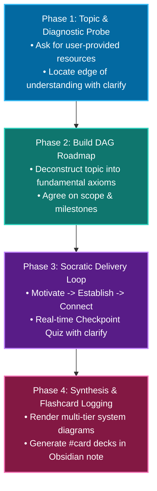

# Pedagogical Framework & Teaching Principles

This document specifies the pedagogical architecture adapted from Amos Blomqvist's `learn` system into the Hermes ecosystem.

---

## 1. Core Philosophy: Intuition & First Principles

Learning is not passive consumption of text; it is the iterative repair of mental models.

### Key Pedagogical Pillars:
1. **Never Assume Retention:** Learners naturally forget or require calibration. Sessions start with real-time diagnostic probing rather than relying on stale historical profiles.
2. **Diagnostic Edge Detection:** Probes find the exact boundary of what the user understands. Distractors represent common conceptual traps, not random wrong facts.
3. **Visual Architecture Over Prose:** High-density text walls are replaced by structured multi-tier diagrams (Mermaid flowcharts and standalone SVG vector diagrams).
4. **Consent-Gated Context:** Never scan personal notes in the background. The learner is asked directly if they wish to supply reference material.
5. **Continuous Spaced Repetition:** Every lesson synthesizes core mechanics into `#card` formatted decks for Obsidian Spaced Repetition.

---

## 2. The 4-Phase Teaching Lifecycle

---

## 3. Misconception Handling & Distractor Engineering

When crafting checkpoint quizzes via `clarify`:
- **Correct Option:** Represents the first-principles truth.
- **Distractor A (The Diff Trap):** Reflects treating systems like naive line diffs.
- **Distractor B (The In-Place Trap):** Reflects treating immutable stores like mutable in-place databases.
- **Distractor C (Path/Naming Trap):** Reflects confusing content bytes with metadata paths.

When a distractor is selected, the system logs the misconception directly in the session notes and provides a targeted mental model repair.

## See also
[[Architecture-and-Components]]
[[Adaptation-Plan]]
[[Codebase-Analysis]]
[[04-Archives/Learn/Docs/README|README]]
