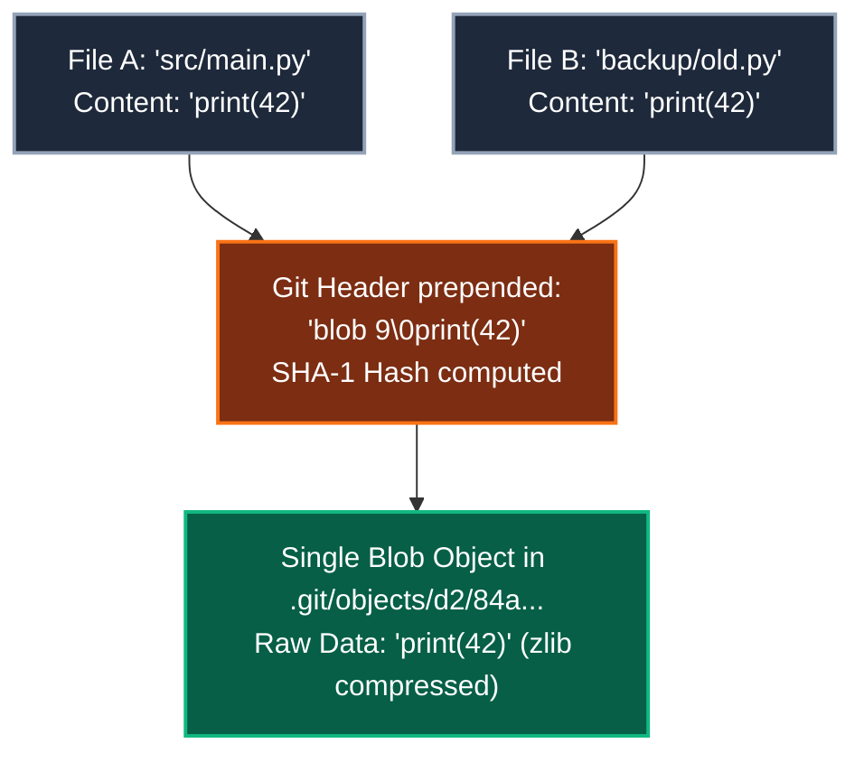
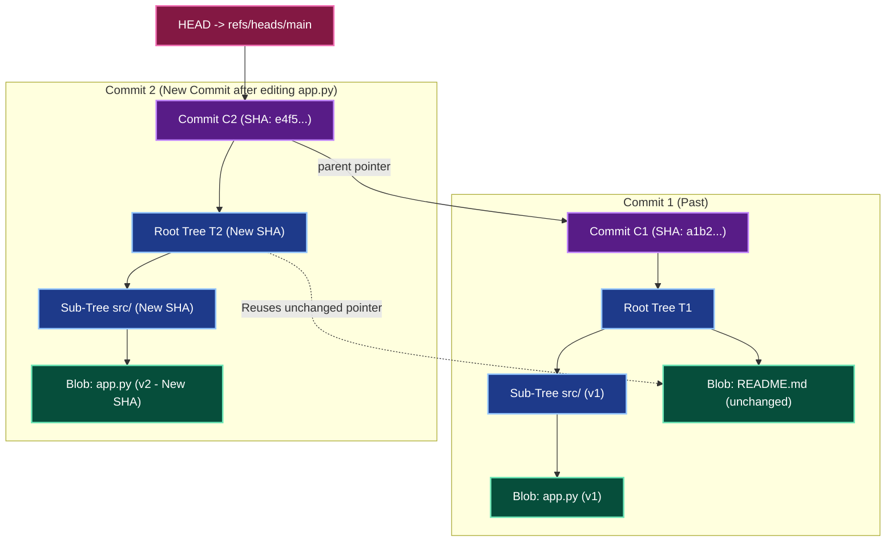

# Lesson: How Git Works Under the Hood

**Topic:** Git Internals (Blobs, Trees, Commits, Refs)
**Date:** 2026-10-01
**Related Notes:** [[04-Archives/Learn/README|Learn Archive]] | [[04-Archives/Learn/Docs/Architecture-and-Components|Architecture & Components]] | [[04-Archives/Learn/Docs/Pedagogical-Framework|Pedagogical Framework]]
**Goal:** Build a robust, intuitive mental model of Git's internal object store, immutability guarantees, and pointer architecture.

---

## 1. System Architecture Flowchart

Below is the complete multi-tier engineering architecture of Git's internal subsystem:

```mermaid
flowchart LR
    classDef client fill:#0369a1,stroke:#38bdf8,stroke-width:2px,color:#fff;
    classDef staging fill:#0f766e,stroke:#2dd4bf,stroke-width:2px,color:#fff;
    classDef engine fill:#581c87,stroke:#c084fc,stroke-width:2px,color:#fff;
    classDef dag fill:#4c1d95,stroke:#a78bfa,stroke-width:2px,color:#fff;
    classDef ref fill:#831843,stroke:#f43f5e,stroke-width:2px,color:#fff;
    classDef storage fill:#78350f,stroke:#fbbf24,stroke-width:2px,color:#fff;

    subgraph Tier1 ["1. Client & Workspace"]
        User["User Edits<br/>(Working Tree)"]:::client
        CLI["Porcelain Commands<br/>(add, commit, checkout)"]:::client
    end

    subgraph Tier2 ["2. Staging & Pipeline"]
        Index[".git/index<br/>Binary Stat Cache &amp; Staged Paths"]:::staging
        Hasher["hash-object<br/>Header + SHA Calculator"]:::staging
    end

    subgraph Tier3 ["3. Object Synthesis Engine"]
        BlobBuilder["Blob Builder<br/>Pure Byte Stream"]:::engine
        TreeBuilder["Tree Builder<br/>write-tree Hierarchy Index"]:::engine
        CommitBuilder["Commit Builder<br/>commit-tree + Parent Linker"]:::engine
    end

    subgraph Tier4 ["4. Content-Addressed DAG"]
        RootTree["Root Tree Object<br/>(8fa3c9b...)"]:::dag
        SubTrees["Sub-Tree Objects<br/>(src/, lib/)"]:::dag
        Blobs["Blob Objects<br/>(Raw byte storage)"]:::dag
        CommitObj["Commit Object<br/>(Metadata + Tree + Parents)"]:::dag
    end

    subgraph Tier5 ["5. References & State"]
        HeadRef["HEAD File<br/>(ref: refs/heads/main)"]:::ref
        BranchRef["Branch Tip File<br/>(.git/refs/heads/main)"]:::ref
    end

    subgraph Tier6 ["6. Disk Persistence"]
        Loose["Loose Objects Store<br/>.git/objects/xx/ (zlib)"]:::storage
        Packfiles["Packfile Subsystem<br/>.pack (delta) + .idx (offsets)"]:::storage
        Reflog["Reflog Engine<br/>.git/logs/HEAD"]:::storage
    end

    User -->|"1. git add"| CLI
    CLI --> Hasher
    Hasher -->|"Writes staged SHA"| Index
    Hasher -->|"Writes loose object"| BlobBuilder
    BlobBuilder --> Blobs
    Blobs --> Loose

    CLI -->|"2. git commit"| TreeBuilder
    Index --> TreeBuilder
    TreeBuilder --> RootTree
    RootTree --> SubTrees
    SubTrees --> Blobs

    TreeBuilder --> CommitBuilder
    CommitBuilder --> CommitObj
    CommitObj --> RootTree
    CommitObj --> Loose

    CommitBuilder -->|"3. Moves tip"| BranchRef
    HeadRef --> BranchRef
    CommitBuilder -->|"Appends history"| Reflog

    Loose -.->|"git gc (compaction)"| Packfiles
```

![[git-internals-architecture.svg|700]]

---

## 2. Deep-Dive Visual Mechanisms

### A. Inside a Blob & Deduplication
A **Blob** stores *only raw bytes*. Filenames and paths live outside the blob in directory trees.

> [!abstract] Unconditional Invariant: Blobs
> $\text{Blob Hash} = \text{SHA}\left(\text{"blob "} + \text{byte\_length} + \text{"\0"} + \text{content}\right)$
> - Because identical files share the exact same byte hash, Git **deduplicates automatically at zero extra storage cost**.
> - The blob does **not** know what it is named or what folder it lives in.

---

### B. What Actually Happens During a Commit (Immutability)
Git **never overwrites** old objects. Modifying 1 line in `app.py` creates a brand-new blob and new parent trees, while unchanged blobs are cleanly reused:

---

## 3. Session Diagnostics & Checkpoint Insights

> [!question] Checkpoint 1: Identical content across different folders
> **Question:** If `src/main.py` and `backup/old_main.py` have identical code, what is stored in `.git/objects/`?
> - **Misconception:** Two separate blobs are stored because the paths and filenames differ.
> - **Mental Model Repair:** Blobs store raw byte payloads only. Filenames exist strictly inside Tree objects. Git stores **only one blob**.

> [!question] Checkpoint 2: What happens on a new commit?
> **Question:** When editing 1 line in `src/app.py` and committing, what is created?
> - **Misconception:** The existing commit object is modified in-place with a diff.
> - **Mental Model Repair:** Git is strictly **append-only and immutable**. Because an object's ID is the hash of its content, altering any byte changes its hash. Git writes **1 new blob**, **new parent trees**, and **1 new commit object** pointing back to the previous commit.

---

## 4. Spaced Repetition Flashcards

### Foundational Concept Cards
What does a Git Blob object store? #card
Only the raw byte contents of a file. It does NOT store filenames, directory paths, or file permissions.
<!--ID: 1727800000001-->

Where are filenames and directory permissions stored in Git's object model? #card
Inside Tree objects. A Tree maps (mode, name) pairs to Blob and sub-Tree hashes.
<!--ID: 1727800000002-->

What are the four fundamental object types in Git? #card
1. **Blob**: Raw file contents
2. **Tree**: Directory listing (names, modes, object hashes)
3. **Commit**: Snapshot pointer to root tree + parent commit(s) + author/message metadata
4. **Tag**: Annotated named reference pointing to an object
<!--ID: 1727800000003-->

Why does Git never modify an existing object in `.git/objects/` in-place? #card
Because Git is a content-addressable filesystem. An object's filename is the cryptographic hash of its exact bytes. Any modification produces a brand-new hash (a new object file).
<!--ID: 1727800000004-->

What actually is a Git branch under the hood? #card
A plain 41-byte text file located at `.git/refs/heads/<branch-name>` containing the SHA hash of the latest commit on that branch.
<!--ID: 1727800000005-->

What does a Git Commit object point to to represent the repository state? #card
It points directly to a single **Root Tree object**, which represents the complete snapshot of the project at that moment in time.
<!--ID: 1727800000006-->

### Practical & Architectural Cards
What is the function of the `.git/index` staging file? #card
It acts as a binary stat cache and staging buffer that records the paths, modes, and Blob SHA hashes representing the proposed state of the *next* commit.
<!--ID: 1727800000010-->

How does Git prevent redundant storage when the same 50MB file is committed across 100 different commits without edits? #card
The root Tree for each new commit simply points to the same pre-existing Blob SHA hash. The file is stored only once in `.git/objects/`.
<!--ID: 1727800000011-->

What happens when `git gc` runs? #card
It compresses individual loose objects from `.git/objects/xx/` into packfiles (`.pack`) using delta compression and generates binary offset indexes (`.idx`).
<!--ID: 1727800000012-->

### Cloze Deletion Cards
Git is not a diff tracker; it is a ==content-addressable== filesystem that stores a directed acyclic graph of immutable ==snapshots==. #card
<!--ID: 1727800000007-->

When 100 identical files exist across different directories in a Git repository, Git creates exactly ==one== blob object in `.git/objects/`. #card
<!--ID: 1727800000008-->

A Git commit's parent pointer creates a ==directed acyclic graph (DAG)== where history can only grow forward because a commit's hash depends on its ==parent's hash==. #card
<!--ID: 1727800000009-->
